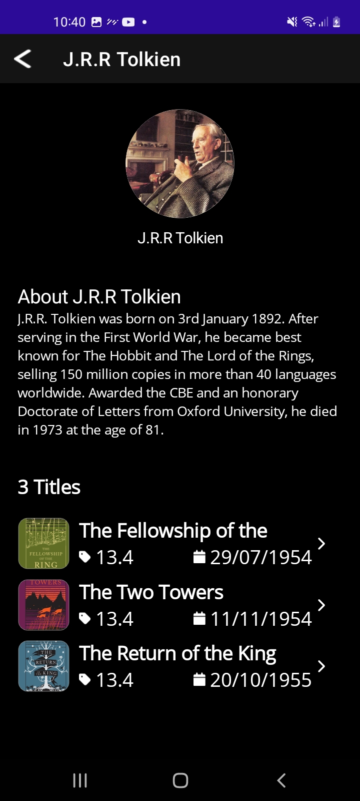
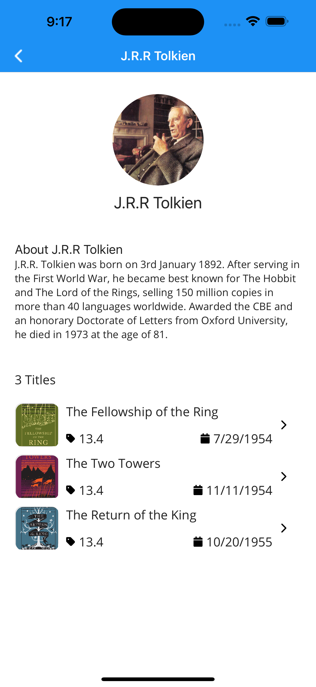
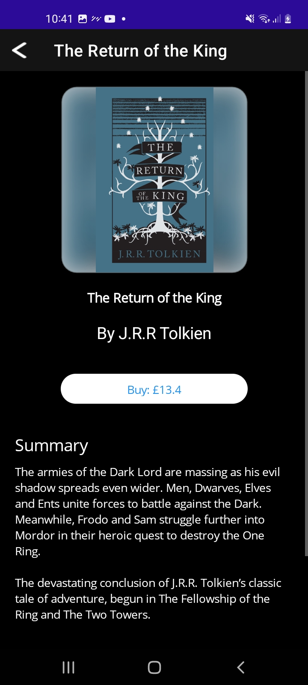
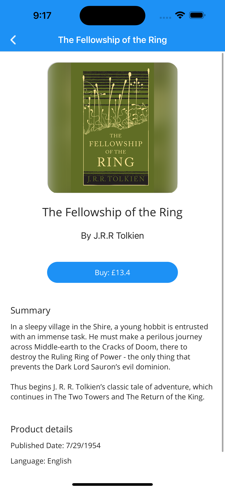

# MauiBookshop
A little demo using EFCore to access sqlite in Maui.

This app uses EFCore to manage a Sqlite database, there are database migrations and data seeding being used in this sample.

> Checkout the `net8` branch to run this app targetting net 8 maui. 

## EFCore

I've had a play around with the setup & architecture for EFCore and maui here. I'm on a solid 6/10 happiness with what I've got in this sample, some things like the initial database startup definitely need more work and consideration. I've also not really considered unit testability for this sample either. A big caviat is that the DAL project **CAN'T** reference Maui (`<UseMaui>true</UseMaui>) otherwise it breaks the EF CLI tooling.

The app database is saved in the `AppDataDirectory`, this is ok for all platforms except macOS since the db just gets dumped in the users `~/Library` without any folder structure, something to consider when building your app for production.

Migrations are working in this sample, I have made 2 migrations:
- Initial database creation
- Added extra info to the entities

To create migrations via VS4Mac:
- Install EFCore CLI util:
```bash
dotnet tool install --global dotnet-ef
```
- Run command:
```bash
dotnet ef migrations add ExtraInformation --project src/Bookshop.DAL/Bookshop.DAL.csproj
```

Migrations get added to the DAL project's `Migrations/` directory and are applied via the `SeedDatabase` app extension method (Called in the MauiProgram).

## Sample App

This is a simple list app with some drill downs, here is the appearance on each platform.

> Note as of .net7, there are some Maui rendering issues that I had to work around, hopefully they get fixed in later versions!

### Authors Page

| Android                                                      | iOS                                                          |
| ------------------------------------------------------------ | ------------------------------------------------------------ |
|  |  |

### Author Detail Page

| Android                                                      | iOS                                                          |
| ------------------------------------------------------------ | ------------------------------------------------------------ |
|  |  |

### Book Detail Page

| Android                                                      | iOS                                                          |
| ------------------------------------------------------------ | ------------------------------------------------------------ |
|  |  |
